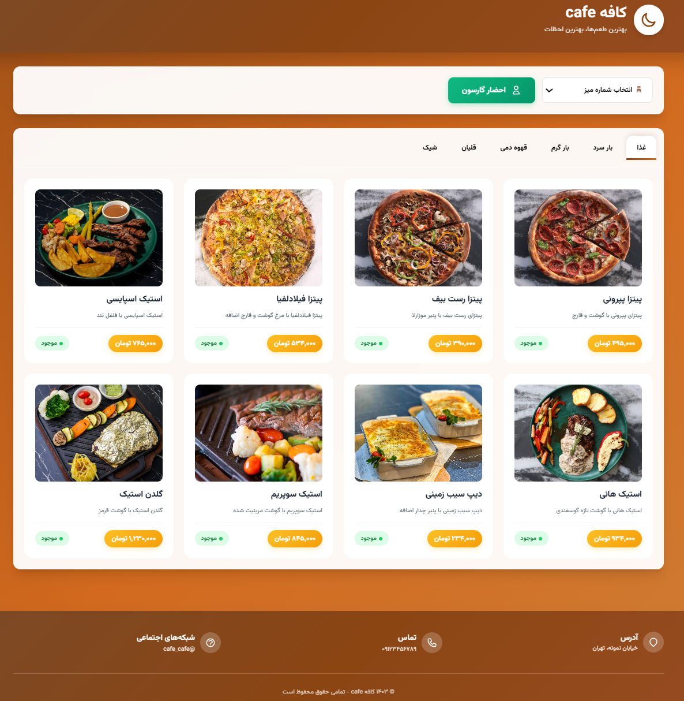

# Cafe Menu 🍵


## 📋 Project Overview

Cafe Menu is a Django-based web application designed for a modern cafe experience. It allows customers to browse a digital menu by category, call a waiter from specific tables, and provides an admin dashboard to monitor waiter call notifications in real-time. The application is styled with Tailwind CSS for a responsive and visually appealing interface, with full support for Persian language (RTL) and a SQLite database for simplicity.

### ✨ Features
- **Digital Menu**: Browse items by category with details like name, description, price, availability, and images.
- **Waiter Call System**: Customers can select a table and call a waiter, with a 1-minute cooldown per table to prevent spam.
- **Admin Dashboard**: Real-time notifications for waiter calls, sorted with oldest at the top.
- **Responsive Design**: Tailwind CSS ensures a modern, mobile-friendly UI with a cafe-themed aesthetic (brown/orange gradient).
- **Persian Support**: Fully RTL interface with Vazirmatn font for Persian text.


---
## [Demo Live](https://mojtabaft.pythonanywhere.com/)
--- 




## 🛠️ Technologies Used
- **Backend**: Django 5.2.6, Python 3.8+
- **Frontend**: HTML, Tailwind CSS (via CDN), JavaScript
- **Database**: SQLite
- **Font**: Vazirmatn (Google Fonts)
- **Dependencies**: jdatetime (for Persian date/time), Pillow (for image handling)


## 🚀 Setup Instructions

Follow these steps to set up and run the project locally.

### Prerequisites
- Python 3.8 or higher
- pip (Python package manager)
- Virtualenv (recommended)

### Installation

1. **Clone the Repository**
   ```bash
   git clone https://github.com/MojtabaFotohi/cafe-menu.git
   cd cafe_menu
   ```

2. **Create and Activate a Virtual Environment**
   ```bash
   python -m venv venv
   source venv/bin/activate  # On Windows: venv\Scripts\activate
   ```

3. **Install Dependencies**
   Install the required packages listed in `requirements.txt`:
   ```bash
   pip install -r requirements.txt
   ```

4. **Apply Migrations**
   ```bash
   python manage.py makemigrations
   python manage.py migrate
   ```

5. **Create a Superuser (for Admin Dashboard)**
   ```bash
   python manage.py createsuperuser
   ```

6. **Collect Static Files (if needed)**
   ```bash
   python manage.py collectstatic
   ```

7. **Run the Development Server**
   ```bash
   python manage.py runserver
   ```

8. **Access the Application**
   - Menu: `http://localhost:8000/`
   - Admin Dashboard: `http://localhost:8000/dashboard/`
   - Django Admin: `http://localhost:8000/admin/`

### Notes
- Ensure the `media/` directory is writable for image uploads.
- For production, replace Tailwind CDN with a compiled CSS file (see Tailwind docs for setup).
- Add indexes to `Category` and `Item` models for better query performance if needed.
- The `requirements.txt` file lists exact package versions to ensure compatibility.

## 🎨 Usage
- **Customers**: Select a table, browse menu items by category, and call a waiter using the "احضار گارسون" button.
- **Admins**: Log in to the dashboard (`/dashboard/`) with superuser credentials to view waiter call notifications. Notifications are sorted with the oldest at the top.
- **Django Admin**: Manage categories, items, tables, and waiter calls at `/admin/`.


## 📝 License
This project is licensed under the MIT License.

## 🤝 Contributing
Feel free to submit pull requests or open issues for improvements or bug fixes.

## ☕ About
Built for Cafe to enhance the customer experience with a digital menu and efficient waiter call system. Enjoy your coffee! ☕
